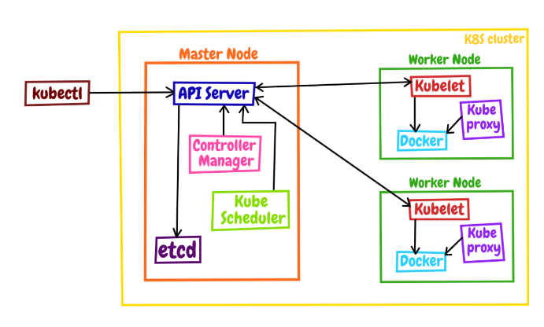
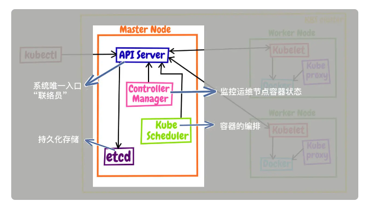
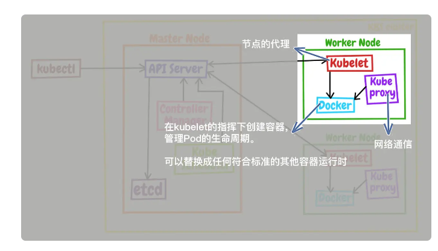

apiserver是 Kubernetes 系统的唯一入口,采用http协议对外提供接口

使用以下指令查看当前 Kubernetes 版本支持的所有对象

```
kubectl api-resources
```

在使用 kubectl 命令的时候，你还可以加上一个参数 --v=9，它会显示出详细的命令执行过程，清楚地看到发出的 HTTP 请求

```
kubectl get pod --v=9
```

demo

```
apiVersion: v1
kind: Pod
metadata:
  name: ngx-pod
  labels:
    env: demo
    owner: chrono

spec:
  containers:
  - image: nginx:alpine
    name: ngx
    ports:
    - containerPort: 80
```

```
kubectl run ngx --image=nginx:alpine
```

两条命令是等价的

除了api-resources还可以使用explain查看文档

```
kubectl explain pod
kubectl explain pod.metadata
kubectl explain pod.spec
kubectl explain pod.spec.containers
```

使用空转参数和生成yaml参数，验证脚本，生成yaml配置文件

```
kubectl run ngx --image=nginx:alpine --dry-run=client -o yaml
```

