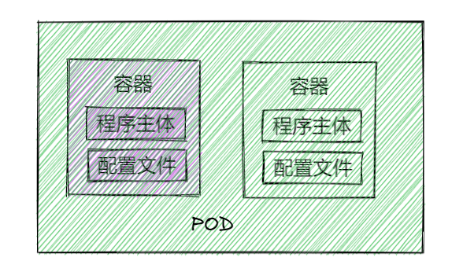
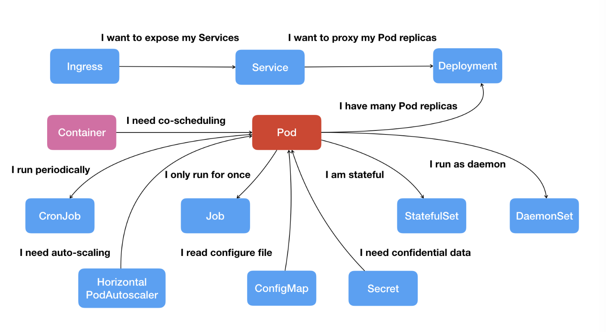

创建

```
spec:
  containers:
  - image: busybox:latest
    name: busy
    imagePullPolicy: IfNotPresent
    env:
      - name: os
        value: "ubuntu"
      - name: debug
        value: "on"
    command:
      - /bin/echo
    args:
      - "$(os), $(debug)"
```

```
kubectl apply -f busy-pod.yml
```

删除

```
kubectl delete -f busy-pod.yml
kubectl delete pod busy-pod
```

日志

```
kubectl logs busy-pod
```

查看

```
kubectl get pod
kubectl describe pod busy-pod
```

复制文件

```
echo 'aaa' > a.txt
kubectl cp a.txt ngx-pod:/tmp
```

进入容器

```
kubectl exec -it ngx-pod -- sh
```

