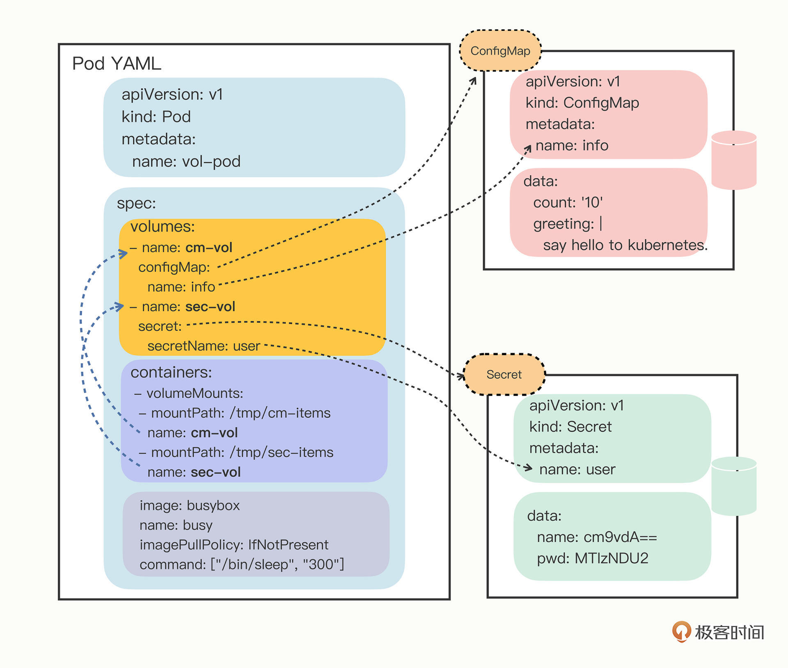

配置管理

以YAML的形式管理配置信息：ConfigMap和Secret，区别是前者是明文，后者是加密的

cm是ConfigMap的简称,data部分存储主要的数据

```
export out="--dry-run=client -o yaml"        # 定义Shell变量
kubectl create cm info $out

kubectl create cm info --from-literal=k=v $out

kubectl apply -f cm.yml
```


```
kubectl get cm
kubectl describe cm info
```

secret

```
kubectl create secret generic user --from-literal=name=root $out
```

输出的值是处理后的乱码一样的字符串，解密

```
echo -n "123456" | base64
MTIzNDU2
```

```
kubectl apply -f secret.yml
kubectl get secret
kubectl describe secret user
```


> ConfigMap 和 Secret 只是一些存储在 etcd 里的字符串，所以如果想要在运行时产生效果，就必须要以某种方式“注入”到 Pod 里，让应用去读取
>
> 使用方式 环境变量和加载文件

###### 环境变量方式

使用valueFrom

可以使用configMapKeyRef或者secretKeyRef

```

apiVersion: v1
kind: Pod
metadata:
  name: env-pod

spec:
  containers:
  - env:
      - name: COUNT
        valueFrom:
          configMapKeyRef:
            name: info #API 对象的名字
            key: count #字段key
      - name: GREETING
        valueFrom:
          configMapKeyRef:
            name: info
            key: greeting
      - name: USERNAME
        valueFrom:
          secretKeyRef:
            name: user
            key: name
      - name: PASSWORD
        valueFrom:
          secretKeyRef:
            name: user
            key: pwd

    image: busybox
    name: busy
    imagePullPolicy: IfNotPresent
    command: ["/bin/sleep", "300"]
```

```
kubectl explain pod.spec.containers.env.valueFrom
```


###### 基于Volume的方式使用 ConfigMap/Secret

Kubernetes 为 Pod 定义了一个“Volume”的概念，意为存储卷。

- 可以为 Pod“挂载（mount）”多个 Volume
- 在“spec”里增加一个“volumes”字段，然后再定义卷的名字和引用的 ConfigMap/Secret 就可以了


定义Volume

```
spec:
  volumes:
  - name: cm-vol
    configMap:
      name: info
  - name: sec-vol
    secret:
      secretName: user
```

挂载

```
  containers:
  - volumeMounts:
    - mountPath: /tmp/cm-items
      name: cm-vol
    - mountPath: /tmp/sec-items
      name: sec-vol
```



```
apiVersion: v1
kind: Pod
metadata:
  name: vol-pod

spec:
  volumes:
  - name: cm-vol
    configMap:
      name: info
  - name: sec-vol
    secret:
      secretName: user

  containers:
  - volumeMounts:
    - mountPath: /tmp/cm-items
      name: cm-vol
    - mountPath: /tmp/sec-items
      name: sec-vol

    image: busybox
    name: busy
    imagePullPolicy: IfNotPresent
    command: ["/bin/sleep", "300"]
```

