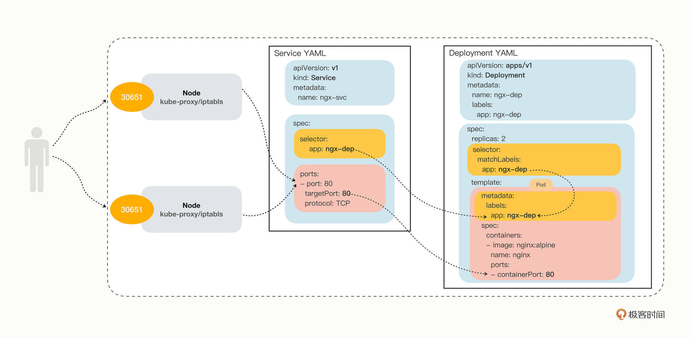

# Service

负载均衡+服务发现

Pod总是处于创建、销毁的动态变化过程中，Deployment 和 DaemonSet解决了节点数量的问题，还需一个服务来解决客户端访问Pod的问题。

解决方法：负载均衡


iptables： 每个节点上的 kube-proxy 组件自动维护 iptables 规则，客户不再关心 Pod 的具体地址，只要访问 Service 的固定 IP 地址，Service 就会根据 iptables 规则转发请求给它管理的多个 Pod

Service 并不是只能使用 iptables 来实现负载均衡，它还有另外两种实现技术：性能更差的 userspace 和性能更好的 ipvs，自k8s1.1以后,service默认使用ipvs规则，若ipvs没有被激活，则降级使用iptables规则. 但在1.1以前，service
　使用的模式默认为userspace.


kubectl expose 支持从多种对象创建服务，Pod、Deployment、DaemonSet等


```
kubectl api-resources
kubectl explain service.spec
```


```
export out="--dry-run=client -o yaml"
kubectl expose deploy ngx-dep --port=80 --target-port=80 $out
```


```
apiVersion: v1
kind: Service
metadata:
  name: ngx-svc
  
spec:
  selector:
    app: ngx-dep
    
  ports:
  - port: 80
    targetPort: 80
    protocol: TCP
```

- selector: 过滤出要代理的那些 Pod
- ports


```
apiVersion: v1
kind: ConfigMap
metadata:
  name: ngx-conf

data:
  default.conf: |
    server {
      listen 80;
      location / {
        default_type text/plain;
        return 200
          'srv : $server_addr:$server_port\nhost: $hostname\nuri : $request_method $host $request_uri\ndate: $time_iso8601\n';
      }
    }
```

```
apiVersion: apps/v1
kind: Deployment
metadata:
  name: ngx-dep

spec:
  replicas: 2
  selector:
    matchLabels:
      app: ngx-dep

  template:
    metadata:
      labels:
        app: ngx-dep
    spec:
      volumes:
      - name: ngx-conf-vol
        configMap:
          name: ngx-conf

      containers:
      - image: nginx:alpine
        name: nginx
        ports:
        - containerPort: 80

        volumeMounts:
        - mountPath: /etc/nginx/conf.d
          name: ngx-conf-vol
```


```
kubectl describe svc ngx-svc
```


命名空间：Service 对象的域名完全形式是“对象. 名字空间.svc.cluster.local

##### 对外暴露服务

service的"type"属性表示 Service 是哪种类型的负载均衡，默认是ClusterIP，可选ExternalName，LoadBalancer，NodePort

> 如果我们在使用命令 kubectl expose 的时候加上参数 --type=NodePort，或者在 YAML 里添加字段 type:NodePort，那么 Service 除了会对后端的 Pod 做负载均衡之外，还会在集群里的每个节点上创建一个独立的端口，用这个端口对外提供服务，这也正是“NodePort”这个名字的由来。

```
D:\dev\Minikube>kubectl.exe explain service.spec.type --recursive=false
KIND:     Service
VERSION:  v1

FIELD:    type <string>

DESCRIPTION:
     type determines how the Service is exposed. Defaults to ClusterIP. Valid
     options are ExternalName, ClusterIP, NodePort, and LoadBalancer.
     "ClusterIP" allocates a cluster-internal IP address for load-balancing to
     endpoints. Endpoints are determined by the selector or if that is not
     specified, by manual construction of an Endpoints object or EndpointSlice
     objects. If clusterIP is "None", no virtual IP is allocated and the
     endpoints are published as a set of endpoints rather than a virtual IP.
     "NodePort" builds on ClusterIP and allocates a port on every node which
     routes to the same endpoints as the clusterIP. "LoadBalancer" builds on
     NodePort and creates an external load-balancer (if supported in the current
     cloud) which routes to the same endpoints as the clusterIP. "ExternalName"
     aliases this service to the specified externalName. Several other fields do
     not apply to ExternalName services. More info:
     https://kubernetes.io/docs/concepts/services-networking/service/#publishing-services-service-types
```

```

apiVersion: v1
...
spec:
  ...
  type: NodePort
```

```
kubectl get svc
```

