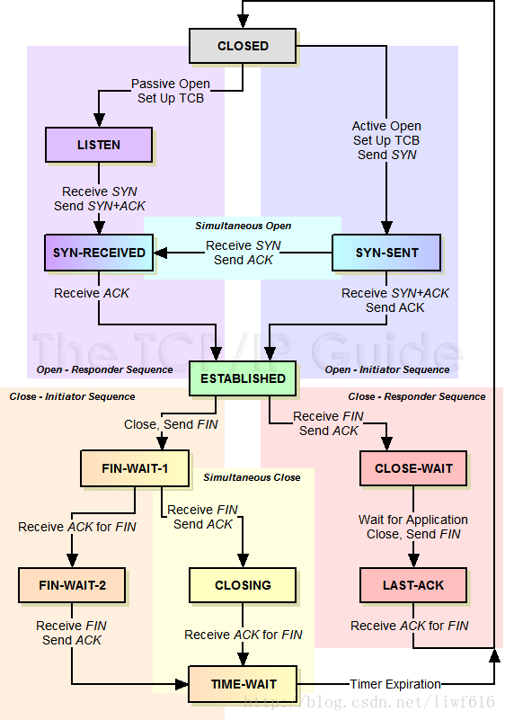

检测TIME_WAIT状态的语句：

```
netstat -n | awk '/^tcp/ {++S[$NF]} END {for(a in S) print a, S[a]}'
```

1
返回结果：

TIME_WAIT 1000
CLOSE_WAIT 5
FIN_WAIT2 20
ESTABLISHED 10000
LAST_ACK 11


CLOSED：无连接是活动的或正在进行

LISTEN：服务器在等待进入呼叫

SYN_RECV：一个连接请求已经到达，等待确认

SYN_SENT：应用已经开始，打开一个连接

ESTABLISHED：正常数据传输状态

FIN_WAIT1：应用说它已经完成

FIN_WAIT2：另一边已同意释放

ITMED_WAIT：等待所有分组死掉

CLOSING：两边同时尝试关闭

TIME_WAIT：另一边已初始化一个释放

LAST_ACK：等待所有分组死掉


2. TCP状态解析
State:

表TCP连接状态

ESTABLISHED:

指TCP连接已建立，双方可以进行方向数据传递

CLOSE_WAIT:

这种状态的含义其实是表示在等待关闭。当对方close一个SOCKET后发送FIN报文给自己，你系统毫无疑问地会回应一个ACK报文给对方，此时则进入到CLOSE_WAIT状态。接下来呢，实际上你真正需要考虑的事情是察看你是否还有数据发送给对方，如果没有的话， 那么你也就可以close 这个SOCKET，发送 FIN 报文给对方，也即关闭连接。所以你在CLOSE_WAIT 状态下，需要完成的事情是等待你去关闭连接。

LISTENING:

指TCP正在监听端口，可以接受链接

TIME_WAIT:

指连接已准备关闭。表示收到了对方的FIN报文，并发送出了ACK报文，就等2MSL后即可回到CLOSED可用状态了。如果FIN_WAIT_1状态下，收到了对方同时带FIN标志和ACK标志的报文时，可以直接进入到TIME_WAIT状态，而无须经过FIN_WAIT_2 状态。

FIN_WAIT_1:

这个状态要好好解释一下，其实FIN_WAIT_1和 FIN_WAIT_2状态的真正含义都是表示等待对方的FIN报 文。而这两种状态的区别是：FIN_WAIT_1状态实际上是当SOCKET在ESTABLISHED状态时，它想主动关闭连接，向对方发送了FIN 报文，此时该SOCKET即进入到FIN_WAIT_1 状态。而当对方回应ACK 报文后，则进入到FIN_WAIT_2状态，当然在实际的正常情况 下，无论对方何种情况下，都应该马上回应ACK报文，所以FIN_WAIT_1状态一般是比较难见到的，而FIN_WAIT_2 状态还有时常常可以用 netstat看到。

FIN_WAIT_2：

上面已经详细解释了这种状态，实际上FIN_WAIT_2 状态下的SOCKET，表示半连接，也即有一方要求close 连接，但另外还告诉对方，我暂时还有点数据需要传送给你，稍后再关闭连接。

LAST_ACK:

是被动关闭一方在发送FIN报文后，最后等待对方的ACK报文。当收到ACK报文后，也即可以进入到CLOSED可用状态了

SYNC_RECEIVED:

收到对方的连接建立请求,这个状态表示接受到了SYN报文，在正常情况下，这个状态是服务器端的SOCKET在建立TCP连接时的三次握手会话过程中的一个中间状态，很短暂，基本上用netstat你是很难看到这种状态的，除非你特意写了一个客户端测试程序，故意将三次TCP握手过程中最后一个ACK报文不予发送。因此这种状态时，当收到客户端的ACK报文后，它会进入到ESTABLISHED状态。

SYNC_SEND:

已经主动发出连接建立请求。与SYN_RCVD遥想呼应，当客户端SOCKET执行CONNECT连接时，它首先发送SYN报文，因此也随即它会进入到了SYN_SENT状态，并等待服务端的发送三次握手中的第2个报文。上述状态的定义与TCP规则定义的TCP状态图一致，可以对照如下两张TCP建立与终止链接的状态转换图进行理解。



解决方法一：开启nginx的长连接

```
http{
	upstream www{
		keepalive 65;                                                     # 必须配置，建议50-100之间
	}
	server {
		location / {
			proxy_pass http://www
			proxy_http_version 1.1;                                   # 后端配置支持HTTP1.1，必须配
			proxy_set_header Connection ;                   # 后端配置支持HTTP1.1 ,必须配置。
		}
	}
}

```

解决方法二：修改系统参数

增加以下系统配置：

vim /etc/sysctl.conf

```
net.ipv4.tcp_syncookies = 1       #表示开启SYN Cookies。当出现SYN等待队列溢出时，启用cookies来处理，可防范少量SYN×××，默认为0，表示关闭
net.ipv4.tcp_tw_reuse=1           #让TIME_WAIT状态可以重用，这样即使TIME_WAIT占满了所有端口，也不会拒绝新的请求造成障碍 默认是0
net.ipv4.tcp_tw_recycle=1         #让TIME_WAIT尽快回收 默认0
net.ipv4.tcp_fin_timeout=65        #表示如果套接字由本端要求关闭，这个参数决定了它保持在FIN-WAIT-2状态的时间。
```

```
sysctl -p                        #加载内核文件，快速生效。
```

