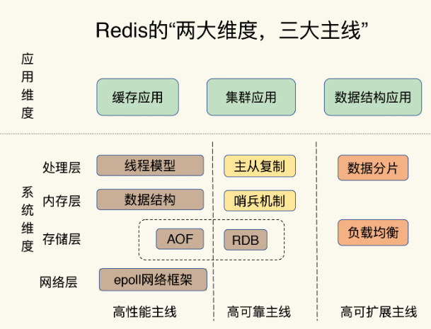
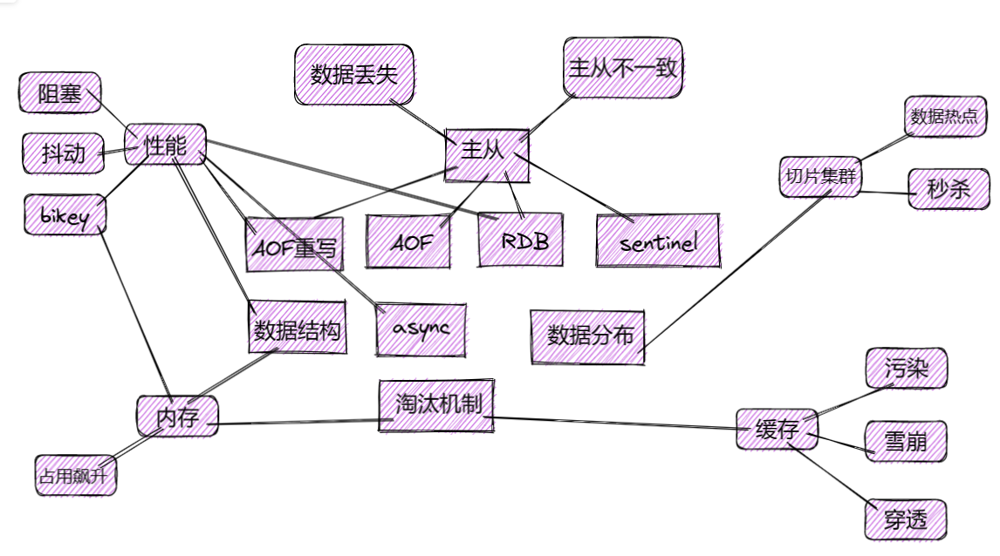

Redis的两大维度，三大主线

- 维度
  - 应用维度
    - 缓存应用
    - 集群应用
    - 数据结构应用
  - 系统维度
    - 网络层
      - epoll
    - 存储层
      - AOF|RDB
    - 内存层
      - 数据结构
    - 处理层
      - 线程模型

### 主线

高性能主线：线程模型、数据模型、持久化、网络框架

高可靠主线：主从复制、哨兵

搞可扩展主线：数据分片、负载均衡

知识点梳理

问题==》主线==》技术点

