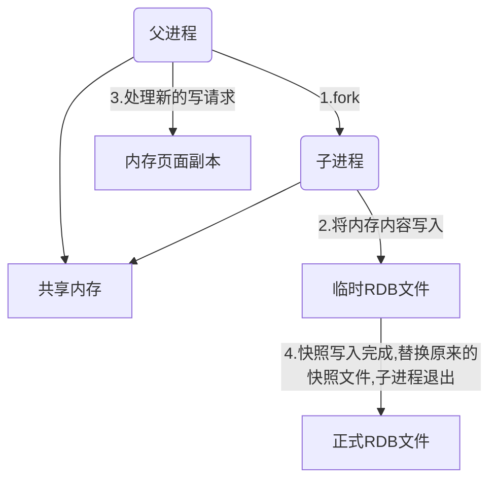
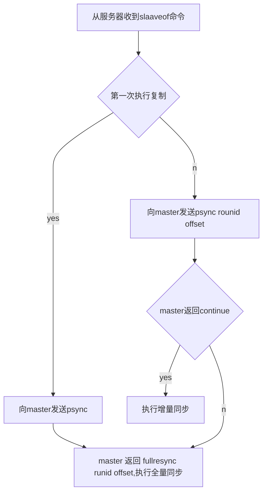

## 什么是Redis？

Redis（Remote Dictionary Server）远程字典服务，是一种基于键值对（key-value）的NoSQL数据库，与很多键值对数据库不同，Redis中的值可以是由string(字符串)、list(链表)、set(集合)、zset(有序集合)和hash（哈希类型）等多种数据结构组成，能够满足很多的应用场景，同时Redis会将所有数据都存放在内存中，读写速度非常快。

基本特性：
基于键值对、读写速度快、数据结构丰富、简单稳定、支持持久化、支持事务（原子性）、主从复制、高可用与分布式

## 为什么说Redis的速度非常快呢？

据官方给出的数字，Redis的读写性可以达到10万/秒，在不考虑硬件性能的化，redis速度如此快的原因可以归纳为一下几点：
（1）Redis中所有数据都是存储在内存中的，CPU对计算器的访问速度中内存远快于外存
（2）Redis是基于C语言实现的，一般来说C语言距离操作系统更近，执行速度相对更快
（3）Redis采用了单线程架构，避免了不必要的上下文切换和竞争条件，线程安全
（4）使用多路 I/O 复用模型，非阻塞 IO；

单线程详解：

- Reds基于 Reactor模式开发的文件事件处理器，它是单线程的，所以Redis才叫做单线程的模型。
- 采用IO多路复用机制来同时监听多个Socket，根据Socket上的事件类型来选择对应的事件处理器来处理这个事件。可以实现高性能的网络通信模型，又可以跟内部其他单线程的模块进行对接，保证了 Redis内部的线程楼型的简单性。
- 文件事件处理器的结构包含4个部分：多个Socket，IO多路短用程序、文件事件分派器以及事件处理器
- 多个 Socket可能井发的产生不同的操作，每个操作对应不同的文件事件，但是IO多路复用程序会监听多个Socket，会将 Socket放入一个队列中排队，每次从队列中取出一个 Socket给事件分派器，事件分派器把 Socket给对对应的事件处理器，然后一个 Socket的事件处理完之后，IO多路复用程序才会将队列中的下一个 Socket给事件分派器，文件事件分派器会根据每个 Socket当前产生的事件，来选择对应的事件处理器来处理。


## 为什么要用 Redis？

读写快、支持的数据类型多、基于内存、高可用

高性能：假如用户第一次访问数据库中的某些数据。这个过程会比较慢，因为是从硬盘上读取的。将该用户访问的数据存在数缓存中，这样下一次再访问这些数据的时候就可以直接从缓存中获取了。操作缓存就是直接操作内存，所以速度相当快。
高并发：直接操作缓存能够承受的请求是远远大于直接访问数据库的，所以我们可以考虑把数据库中的部分数据转移到缓存中去，这样用户的一部分请求会直接到缓存这里而不用经过数据库。


## Redis有哪些数据类型

Redis主要有5种数据类型，包括String，List，Set，Zset，Hash，满足大部分的使用要求

### 字符串（String）

字符串类型是Redis最基础的数据结构（key-value 类型），其它的几种数据结构都是在字符串类型基础上构建的，字符串的值可以是：字符串、数字、二进制，但其值最大不能超过512M。

特性：二进制安全的，计算字符串长度高效、追加字符串高效
使用场景： 缓存、计数器、对象存储缓存（共享session）、限速

### 列表（List）

Redis列表是简单的字符串列表，按照插入顺序排序。你可以添加一个元素到列表的头部或者尾部，也可以获取指定范围指定下标的元素等。一个列表最多可以包含 232 - 1 个元素 (4294967295， 每个列表超过40亿个元素)。
两个特点：

列表中的元素是有序的，可以通过索引下标获取某个元素霍某个某个范围内的元素列表
列表中的元素可以是重复的
使用场景： 消息队列、栈、文章列表、评论等。

### 集合（Set）

Redis的Set是String类型的无序集合，我们不能通过索引获取元素。集合成员是唯一的，这就意味着集合中不能出现重复的数据。Redis中集合是通过哈希表实现的，所以添加，删除，查找的复杂度都是O(1)。集合中最大的成员数为 232 - 1 (4294967295, 每个集合可存储40多亿个成员)。
应用场景： 标签（tag）

### 哈希（Hash）

几乎所有的编程语言都提供了哈希（hash）结构，Redis中 hash 是一个string类型的field和value的映射表value={{field1,value1},{field2,value2}…}，可以将一个Hash表作为一个对象进行存储，表中存放对象的信息。
应用场景： 用户信息缓存

### 有序集合（Zset）

在有序集合中保留了不能有重复成员的特性，但其中的成员是可以排序的，每一个元素都会关联一个double类型的分数（score）作为排序依据，score相同时按字典顺序排序。redis正是通过分数来为集合中的成员进行从小到大的排序。
应用场景： 排行榜系统，成绩单，工资表


## Redis能做什么

缓存、分布式锁 、限流 、消息队列、活跃用户、排行榜

### Redis如何实现异步队列?

使用list类型保存数据信息，rpush生产消息，lpop消费消息，当lpop没有消息时，可以sleep一段时间，然后再检查有没有信息，如果不想sleep的话，可以使用blpop, 在没有信息的时候，会一直阻塞，直到信息的到来。redis可以通过pub/sub主题订阅模式实现一个生产者，多个消费者，当然也存在一定的缺点，当消费者下线时，生产的消息会丢失。

### Redis如何实现延时队列？

使用sortedset，使用时间戳做score, 消息内容作为key,调用zadd来生产消息，消费者使用zrangbyscore获取n秒之前的数据做轮询处理。


## Redis 的持久化机制是什么？各自的优缺点？

Redis是一个基于内存的数据库，当redis服务器重启，获取电脑重启，数据会丢失，我们可以将redis内存中的数据持久化保存到硬盘的文件中。目前Redis支持的存储机制有RDB和AOF。

### RDB机制（Redis Database）

RDB是Redis默认的持久化方式，他每隔一段时间会把当前进程数据生成快照保存到硬盘的过程，对应产生的数据文件为dump.rdb。通过配置文件中的save参数来定义快照的周期。

#### 优点

- 只有一个文件 dump.rdb，方便持久化。
- 容灾性好，一个文件可以保存到安全的磁盘，方便备份。
- 性能最大化，fork 子进程来完成写操作，让主进程继续处理命令，所以是 IO 最大化。使用单独子进程来进行持久化，主进程不会进行任何 IO 操作，保证了 redis 的高性能
- 相对于数据集大时，比 AOF 的启动效率更高。

#### 缺点

- 数据安全性低。RDB 是间隔一段时间进行持久化，如果持久化之间 redis 发生故障，会发生数据丢失。所以这种方式更适合数据要求不严谨的时候)
- 由于RDB是通过fork子进程来协助完成数据化工作的，因此，如果数据集较大，可能导致整个服务器停止服务几百毫秒，甚至1秒钟。

#### 相关操作

- 父进程执行fork操作创建子进程
- 子进程创建RDB文件，根据父进程内存生成临时快照文件，完成后对原来文件进行原子替换。
- 进程发送信号给父进程表示完成，父进程更新统计信息。




### AOF持久化方式： （Append Only File）

AOF是指所有的命令行记录以 redis 命令请求协议的格式完全持久化存储，保存为 aof 日志文件，重启时重新执行AOF文件中的命令来恢复文件。（aof默认是文件无限追加，大小会不断扩张，如果是文件过大就需要写很久）

开启AOF需要我们设置配置：appendonly yes，默认不打开。文件名通过appendfilename配置设置，默认文件名为appendonly.aof。

### 优点

- 数据安全，aof 持久化可以配置 appendfsync 属性（每秒同步、没修改同步、不同步），比如always：每进行一次命令操作就记录到 aof 文件中一次。
- 通过 append 模式写文件，即使中途服务器宕机，可以通过 redis-check-aof 工具解决数据一致性问题。
- AOF 机制的 rewrite 模式。AOF 文件没被 rewrite 之前（文件过大时会对命令 进行合并重写），可以删除其中的某些命令（比如误操作的 flushall）)

### 缺点

- AOF 文件比 RDB 文件大，且恢复速度慢。
- 数据集大的时候，比 rdb 启动效率低。

### 执行流程

- 命令写入（append）：所有命令会追加到aof_buf（缓冲区）中。
- 文件同步（sync）：AOF缓冲区根据对应的策略向硬盘做同步操作。
- 文件重写（rewrite）：随着文件越来越大，需要定期对AOF文件进行重写，达到压缩目的。
- 重启加载（load）：重启时，可以加载AOF文件进行数据恢复

一般来说， 会同时使用两种持久化功能。在这种情况下，当 Redis 重启的时候会优先载入AOF文件来恢复原始的数据，AOF文件比RDB更新频率高，保存数据集比较完整，但是文件比较大，性能没有AOF好（快照备份简单、恢复更快）。


## Redis持久化数据和缓存怎么做扩容？

如果Redis被当做缓存使用，使用一致性哈希实现动态扩容缩容。如果Redis被当做一个持久化存储使用，必须使用固定的keys-to-nodes映射关系，节点的数量一旦确定不能变化。否则的话，必须使用可以在运行时进行数据再平衡的一套系统，而当前只有Redis集群可以做到这样。

分布式Redis为了防止扩容，一般一开始就会启动较多实例：
一开始就多设置几个Redis实例，例如32或者64个实例，对大多数用户来说这操作起来可能比较麻烦，但是从长久来看做这点牺牲是值得的。这样的话，当你的数据不断增长，需要更多的Redis服务器时，你需要做的就是仅仅将Redis实例从一台服务迁移到另外一台服务器而已。一旦你添加了另一台服务器，你需要将你一半的Redis实例从第一台机器迁移到第二台机器。

## Redis的过期键的删除策略

Redis是key-value数据库，我们可以设置Redis中缓存的key的过期时间。过期策略通常有以下三种：（Redis使了惰性过期和定期过期）

- 定时过期：每个设置过期时间的key都需要创建一个定时器，到过期时间就会立即清除。该策略可以立即清除过期的数据，对内存很友好；但是会占用大量的CPU资源去处理过期的数据，从而影响缓存的响应时间和吞吐量。
- 惰性过期：只有当访问一个key时，才会判断该key是否已过期，过期则清除。该策略可以最大化地节省CPU资源，却对内存非常不友好。
- 定期过期：每隔一定的时间，会扫描一定数量的数据库的expires字典中一定数量的key，并清除其中已过期的key。该策略是前两者的一个折中方案。通过调整定时扫描的时间间隔和每次扫描的限定耗时，可以在不同情况下使得CPU和内存资源达到最优的平衡效果。
  expires字典会保存所有设置了过期时间的key的过期时间数据，其中，key是指向键空间中的某个键的指针，value是该键的毫秒精度的UNIX时间戳表示的过期时间。键空间是指该Redis集群中保存的所有键。

```
设置过期时间：expire
设置永久有效：persist
```


## Redis的内存淘汰策略有哪些

Redis的内存淘汰策略是指在Redis的用于缓存的内存不足时，怎样处理需要新写入且需要申请额外空间的数据。

淘汰策略：写入报错、LRU（移除最近最少使用的key）、随机移除key、在设置过期时间的key中使用LRU、在设置过期时间的key中随机移除、移除最早过期的数据

Redis 提供 6 种数据淘汰策略：

- noeviction：当内存不足以容纳新写入数据时，新写入操作会报错。
- allkeys-lru：当内存不足以容纳新写入数据时，在键空间中，移除最近最少使用的key。（这个是最常用的）
- allkeys-random：当内存不足以容纳新写入数据时，在键空间中，随机移除某个key。设置过期时间的键空间选择性移除
- volatile-lru：当内存不足以容纳新写入数据时，在设置了过期时间的键空间中，移除最近最少使用的key。
- volatile-random：当内存不足以容纳新写入数据时，在设置了过期时间的键空间中，随机移除某个key。
- volatile-ttl：当内存不足以容纳新写入数据时，在设置了过期时间的键空间中，有更早过期时间的key优先移除。


## 如何批量找出已知前缀开头的key

使用keys指令可以扫出指定模式的key列表。

如果这个redis正在给线上的业务提供服务，那使用keys指令会有什么问题？
redis的单线程的。keys指令会导致线程阻塞一段时间，线上服务会停顿，直到指令执行完毕，服务才能恢复。这个时候可以使用scan指令，scan指令可以无阻塞的提取出指定模式的key列表，但是会有一定的重复概率，在客户端做一次去重就可以了，但是整体所花费的时间会比直接用keys指令长。


## Redis事务控制

Redis事务的本质是一组命令的集合，一次执行多个指令，事务中所有命令都被序列化，其他客户端提交的命令请求不会插入到事务执行命令序列中，简单来说：要不全执行，要不全不执行。Redis中提供了简单的事务功能，需要multi和exec两个命令实现。

事务执行流程：

开启事务（multi）
命令入队（…）
执行事务（exec）| 取消事务（discard）

在Redis的事务中的命令出现不同错误时，处理机制也会有所差异：

编译型异常（命令错误），事务中所有命令都不会执行，因为Redis没有隔离级别的概念，队列中的命令没有提交之前都不会实际的被执行。
运行时异常（1/0），如果事务队列中存在语法性错误，那么执行命令的时候，其它命令是可以正常执行的，错误命令抛出异常，由此看出Redis的单条命令保证原子性，但是事务并不保证原子性，不支持回滚功能。
Redis事务支持隔离性但不保证原子性：

- Redis 是单进程程序，并且它保证在执行事务时，不会对事务进行中断，事务可以运行直到执行完所有事务队列中的命令为止。因此，Redis 的事务是总是带有隔离性的。
- Redis中，单条命令是原子性执行的，但事务不保证原子性，且没有回滚。事务中任意命令执行失败，其余的命令仍会被执行


### 通过事务实现上锁

**在有些应用场景需要在事务之前，确保事务中的key没有被其它客户端修改过，才执行事务，否则不执行，着类似于乐观锁的概念，在Redis中也提供了相关实现方法：**

- 监视、加锁（watch）
- 取消监视、解锁（unwatch）

### 相关命令：

- MULTI：开启一个事务，它总是返回OK。MULT执行之后，客户端可以继续向服务器发送任意多条命令，这些命令不斜立即被执行，而是被放到个队列中，当EXEC命令被调用时，所有队列中的命令才会被执行。
- EXEC：执行所有事务块内的命令。返回事务块内所有命令的返回值，按命令执行的先后顺序排列。当操作被返回空值null
- DISCARD：客户端可以清空事务队列，并放弃执行事务，并且客户端会从事务状态中退出
- WATCH：乐观锁，可以为Reds事务提供 check-and-set(CAS)行为，可以监控一个或多个键旦其中有一个键被修改(或删除)，之后的事务就不会执行，监控一直持续到EXEC命令
- UNWATCH：可以取消wach对所有key的监控
  

## Redis集群方案

### 主从复制（主数据库读写，从数据库只读）

通过执行slaveof命令或设置slaveof选项，让上一个服务器去复制另一个的服务器的数据。主数据库可以进行读写操作，当写操作导致数据变化时会自动将数据同步给从数据库，而从数据库一般是只读的，并接受主数据库同步过来的数据，一个主数据库可以拥有多个从数据库，而一个从数据库只能拥有一个主数据库。

#### 全量复制：

- 主节点通过 bgsave命令fork子进程进行RDB持久化，该过程是非常消耗CPU、内存(表复制)、硬盘IO的
- 主节点通过网络将RDB文件发送给从节点，对主从节点的带宽都会带来很大的消耗
- 从节点消空老数据、载入新RDB文件的过程是阳塞的，无法响应客户端的命令；如果从节点执行bgrewriteaof，也会带来额外的消耗

##### 部分复制：

- 复制制移量：执行复制的双方，主从节点，分别会维护个复制偏移量offset
- 复制积压缓冲区：主技点内部维护了一个固定长度的、先进先出(队列作为复制积压缓冲区，当主从节点offset的差距过大超过缓冲区长度时，将无法执行部分复制，只能执行全量复制
- 服务器运行ID( runid)：每个 Redis节点，都有其运行ID，运行ID由节点在启动时自动生成，主节点会将自己的运行ID发送给从节点，从节点会将主节点的运行ID存起来。从节点 Redis断开重连的时候，就是根据运行ID来判断同步的进度
- 如果从节点保存的 runid与主节点现在的 runid相同，说明主从节点之前同步过，主节点会继续尝试使用部分复制（到底能不能部分复制还要看 offset和复制积压缓冲区的情况）;
- 如果从节点保存的 runid与主节点现在的rund不同，说明从节点在断线前同步的 Redis节点并不是当前的主节点,只能进行全量复制过程原理
  



### 哨兵模式

哨兵是 redis集群中非常重要的一个组件，主要有以下功能：

- 群监控：负责监控 redis master和 slave进程是否正常工作。
- 消息通知：如果某个 redis实例有故障,那么哨兵负责发送消息作为报警通知给管理员。
- 故障转移：如果 master node挂掉了，会自动转移到 slave node上。
- 配置中心：如果故障转移发生了，通知 client客户端新的 master地址。

哨兵用于实现 redis集群的高可用，本身也是分布式的，作为一个哨兵集群去运行，互相协同工作。

- 故障转移时，判断一个 master node是否宕机了，需要大部分的哨兵都同意才行，涉及到了分布式选举即使部分哨兵节点挂掉了，哨兵集群还是能正常工作的
  哨兵通常需要3个实例，来保证自己的健壮性。
- 哨兵+ redis主从的部暑架构，是不保证数据零丢失的，只能保证 redis集群的高可用性。
- 对于哨兵+ redis主从这种复杂的部罟架构，尽量在测试环境和生产环境，都进行充足的测试和演练。
  

### Redis cluster

Redis cluster是一种服务端 Sharding技术，采用slot（槽）的概念，一共分成16384个槽。将请求发送到任意节点，接收到请求的节点会将查询请求发送到正确的节点上执行

#### 方案说明

- 通过哈希的方式，将数据分片，每个节点均分存储一定哈希槽哈希值区间的数据，默认中4个墙位
- 每份数据分片会存储在多个互为主从的多节点上
- 数据写入先写主节点,再同步到从节点（支持配置为阻塞同步）
- 同一分片多个节点间的数据不保持强一致性
  读取数据时,当客户端操作的key没有分配在该节点上时, redis会返回转向指令,指向正确的节点扩容时需要需要把旧节点的数据迁移一部分到新节点
  在 redis cluster架构下，每个 redis要放开两个端口号，比如一个是6379，另外一个就是加1w的端口号，比如16379。16379端口号是用来进行节点间通信的，也就是 cluster bus的通信，用来进行故障检测、配置更新、故障转移授权。 cluster bus用了另外一种二进制的协议， gossip协议，用于节点间进行高效的数据交换，占用更少的网络带宽和处理时间。

#### 优点

- 无中心架构，支持动态扩容，对业务透明
- 具备 Sentinel的监控和自动 allover故转移能力
- 客户端不需要连接集群所有节点，连接集群中任何一个可用节点即可
- 高性能，客户端直连 redish服务，免去了 proxy代理的损耗

#### 缺点

- 运维也很复杂，数据迁移需要人工干预
- 只能使用0号数据库
- 不自支持批量操作( pipeline管道操作)
- 分布式逻辑和存储模块耦合等
  Redis集群最大节点个数是多少？
  16384个

## 生产环境中的 redis 是怎么部署的？

redis cluster，10 台机器，5 台机器部署了 redis 主实例，另外 5 台机器部署了 redis 的从实例，每个主实例挂了一个从实例，5 个节点对外提供读写服务，每个节点的读写高峰qps可能可以达到每秒 5 万，5 台机器最多是 25 万读写请求/s。

机器是什么配置？
32G 内存+ 8 核 CPU + 1T 磁盘，但是分配给 redis 进程的是10g内存，一般线上生产环境，redis 的内存尽量不要超过 10g，超过 10g 可能会有问题。5 台机器对外提供读写，一共有 50g 内存。
因为每个主实例都挂了一个从实例，所以是高可用的，任何一个主实例宕机，都会自动故障迁移，redis 从实例会自动变成主实例继续提供读写服务。

你往内存里写的是什么数据？每条数据的大小是多少？
商品数据，每条数据是 10kb。100条数据是 1mb，10 万条数据是1g。常驻内存的是 200 万条商品数据，占用内存是 20g，仅仅不到总内存的 50%。高峰期每秒就是 3500 左右的请求量。

## Redis实现分布式锁

可以用来解决 Redis 的并发竞争 Key 问题

实现方式：setnx、radisson、redlock

- setnx：指定的 key 不存在时，才能操作成功，为 key 设置指定的值（已存在则不进行任何操作）
- 设置锁：给所有服务节点设置相同的key，返回为0，则锁获取失败（防止锁被别人所释放可以设置一个线程的唯一标识）
- 删除锁：判断线程唯一标志，再删除（可以设置一个合理的过期时间）

问题：

- 实现的Redis分布式锁，其实不具有可重入性
- 存在任务超时问题，锁自动释放（key过期），导致并发问题

> 如何基于redis实现一个可重入锁
>
> redis锁的释放
>
> redis锁的续期

Redis没有实现可重入性及锁续期，可以通过 radisson解决(类似AQS的实现，看门狗监听机制)

redis多节点数据同步问题：
redlock：上述机制都只操作单节点、即使Redis通过 sentinel保证高可用，如果这个 master节点由于某些原因发生了主从切换，那么就会出现锁丢失的情况( redis同步设置可能数据丢失)。 redlock从多个节点申请锁，当一半以上节点获取成功、锁才算获取成功，redission有相应的实现

Redlock是Redis 官方站提出了一种权威的基于 Redis 实现分布式锁的方式 ，此种方式比原先的单节点的方法更安全。


## 缓存雪崩、缓存穿透、缓存击穿

### 缓存雪崩

是指缓存同一时间大面积的失效，所以，后面的请求都会落到数据库上，造成教据库短时间内承受大量诘求而崩掉。
解决方案：

- 缓存数据的过期时间设置随机，防止同一时间大量数据过期现象发生

- 给每个缓存数据增加相应的缓存标记，记录存是否失效，如果缓存标记失效，则更新数据缓存。

- 缓存预热

- 互斥锁

  

### 缓存穿透

指缓存和数据库中都没有的数据，导致所有的请求都落到数据库上，造成数据库短时间内承受大量请求。
解决方案：

- 接口层增加校验，如用户鉴权校验，id做基础校验，id<=0的直接拦截
- 从缓存取不到的数据，在数据库中也没有取到，这时也可以将 key-value对写为 key-null缓存有效时间可以设置短点，如30秒(设置太长会导致正常情况也没法使用)。这样可以防止攻击用户反复用同一个id暴力攻击
- 采用布隆过滤器，将所有可能存在的数据哈希到个足够大的 bitmap中，一个一定不存在的数据会被这个bitmap拦截掉，从而避免了对底层存储系统的查询压力

### 缓存击穿

指缓存中没有但数据库中有的数据（一般是缓存时间到期），这时由于并发用户特别多，同时读缓存没读到数据，又同时去数据库去取数据，引起数据库压力瞬间増大，造成过大压力。和缓存雪崩不同的是，缓存击穿指并发查同—条数据，缓存雪崩是不同数据都过期了，很多数据都查不到从而查数据库
解决方案：

- 设置热点数据永远不过期。
- 加互斥锁
- 缓存预热


> 缓存预热就是系统上线后，将相关的缓存数据直接加载到缓存系统。这样就可以避免在用户请求的时候，先查询数据库，然后再将数据缓存的问题！用户直接查询事先被预热的缓存数据！

解决方案：

- 直接写个缓存刷新页面，上线时手工操作一下；
- 数据量不大，可以在项目启动的时候自动进行加载；
- 定时刷新缓存；
- 缓存降级


## 如何保证缓存与数据库双写时的数据一致性？

你只要用缓存，就可能会涉及到缓存与数据库双存储双写，你只要是双写，就一定会有数据一致性
的问题，那么你如何解决一致性问题？

- 先删除缓存，再更新数据库：如果删除了缓存，还没有来得及写库MySQL，另一个线程就来读取，发现缓存为空，则去数据库中读取数据写入缓存，此时缓存中为脏数据。所以需要进行读请求和写请求串行化，这样可以保证缓存与数据一致，但是会严重影响系统的吞吐量。
- 先更新数据库，再删除缓存（可以异步）：如果先更新了库，在删除缓存前，写库的线程宕机了，没有删除掉缓存，则也会出现数据不一致情况。
- 先删除缓存，再更新数据库，然后异步延迟一段时间再去删一次缓存，删除可能出现的脏数据：分布式环境中，数据库操作与写缓存操作可能不在一个操作步骤中，需要我们进行异步刷新。


## Redis常见性能问题和解决方案？

- Master最好不要做任何持久化工作，包括内存快照和AOF日志文件，特别是不要启用内存快照做持久化。
- 如果数据比较关键，某个Slave开启AOF备份数据，策略为每秒同步一次。
- 为了主从复制的速度和连接的稳定性，Slave和Master最好在同一个局域网内。
- 尽量避免在压力较大的主库上增加从库
- Master调用BGREWRITEAOF重写AOF文件，AOF在重写的时候会占大量的CPU和内存资源，导致服务load过高，出现短暂服务暂停现象。
- 为了Master的稳定性，主从复制不要用图状结构，用单向链表结构更稳定，即主从关系为：
  Master<–Slave1<–Slave2<–Slave3…，这样的结构也方便解决单点故障问题，实现Slave对Master的替换，也即，如果Master挂了，可以立马启用Slave1做Master，其他不变。